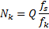
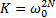
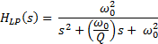
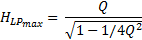
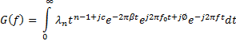
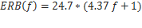

# nupic.audio

Auditory experiments using [cortical learning algorithms](https://scholar.google.co.uk/scholar?q=cortical+learning+algorithms&hl=en&as_sdt=0&as_vis=1&oi=scholart&sa=X&ei=fYM6VZHVMIfqaIPcgNAI&ved=0CB4QgQMwAA) (CLA) and [hierarchical temporal memory](https://scholar.google.co.uk/scholar?q=hierarchical+temporal+memory&hl=en&as_sdt=0&as_vis=1&oi=scholart&sa=X&ei=1IM6Vfy6AZKO7AbSnYDgAQ&sqi=2&ved=0CB4QgQMwAA) (HTM).

## Repositories of interest

- Numenta's [nupic.critic](https://github.com/numenta/nupic.critic) Audio streaming
- [NuMozart](https://github.com/passiweinberger/NuMozart) Digital (MIDI) streaming
- Hackathon scripts and data for [Musenta](https://github.com/jinpan/Musenta)

## Areas of investigation

- Echo location and spatial positioning
- Stream segmentation
- IC processing (differing STRFs)
- Cochleotopic mapping
- Cortical pathways and projections
- 'What' and 'Where'
- Dendritic micro-circuits

From Porr and Wörgötter's (2005) review entitled "Temporal Sequence Learning, Prediction, and Control - A Review of different models and their relation to biological mechanisms", section 6.3 "The Time-gap problem" outlines issues relating to 'bridging the gap between the time-scales of correlation based synaptic plasticity and those of behavioral learning'. Further investigation is required to determine whether aspects of spike-timing dependent plasticity (STDP) is required in a HTM network (LTP and LTD shadowing).

The use of sparse coding is gaining traction in more fields. The use of alternative space-time transforms has also evolved. Taken together, sparse encoding has lead to successful applications, such as the MPEG 2/4 Advanced Audio Codec (i.e. MPEG-1 Layer III) and Wavelet image compression.

Typically signal processing of audio signals involves Cepstral analysis, via linear predictive coding (LPC) or discrete fourier transforms, for example. One drawback of this approach is that the transform produces a linearly spaced representations of the signal. With humans able to reliably detect inter-aural time differences (ITD) as small as 10 micro-seconds, an alternative for encoding of audio signals is modelling the _**spike firing of auditory-nerve fibers**_. A collection of models can be found in the EarLab @ Boston University (http://earlab.bu.edu/ See Modelling -> Downloadable Models).  

## Cochlear nucleus (CN)

Basic auditory sensory mapping is generated in the cochlear by a travelling-wave of displacement along the basilar membrance. With inner hair cells (IHCs) proportionally transducing displacements onto dendrites of auditory nerve fibers (ANFs). Each ANF responds to a limited range of sound frequencies. Where an ANF's most sensitive frequency is known as it's Best Frequency (BF), determined by membrane location. ANFs collectively form a tonotopic mapping. Alternatively a cochleotopic mapping further into the mesencephalon. An inner hair cell connects to one myelinated type I ANF that projects into the cochlear nucleus. Outer hair cells (OHCs) are innverated by unmyelinated type II fibers, projecting from the granule-cell regions of the cochlear nuleus (CN). OHCs seem ideal for addition in attentional feed-back circuits ancd stream seperation processing, as well as obvious frequency selectivity abilities.

Eight main cell types exist inside the CN, including octopus and pyramidal types. A tonotopic organization is maintained in the CN. With fibers bifurcating upon entering the CN, eventually leading to as many as four parallel pre-thalamic pathways (belts). Principle cell types are arranged so that each cell type receives ANFs over the whole tonotpoic range. And each cell type has it's own unique pattern of response to sound. Pattern diversity is covered by;

**1** Nature of innervation (synapses on soma or dendrites)  
**2** Post-synaptic cell membrane properties  
**3** Interneuronal circuitry  

Principal cell types project to different targets in the brainstem. For example, the medial and lateral superior olivary nuclei are unique to the audiotory system (MSO and LSO, resp.). Receiving equal innervation from both ears and performs initial computations for sound localisation. Axons of most sub-collicular projections are in banded patterns, suggestiing selective interaction of inputs from differenct sources. The Inferior Colliculus (IC) is the final pre-thalamic structure in the auditory system.

Major afferent systems in the dorsal cochlear nucleus (DCN) define a two-dimensional array of cells, with tonotpoic axis in one dimension, and some _unknown_ granule-cell response as the other axis. Cartwheel cells, along with Stellate cells, are inhibitory interneurons in layer 1 of the DCN. Cartwheel cells, similar to Purkinje cells, have their axons distributed in layers 2 and 3 of the DCN. And show a tendency to project parallel to the iso-frequency sheets. Cartwheel cells also interact together, and so are likely to be context dependent - excitatory when cells are at rest, but stablizing when the cells are excited. Unipolar Brush Cells (UBC), similar to those in the cerebellum, have been shown to be signal amplifiers. Chestnut cells in the granule-cell areas could serve as integrators for mossy-fiber input bundles. Octopus and D-multipolar cells give repsonses to sound that are called _onset_. Octopus cells give a pure onset response, whereas D-multipolars give a short burst of spikes followed by a varying level of steady-state discharge, called _onset_-C response. onset-C neurons seem to require coincident firing of inputs across a range of BFs in order to produce a strong response. A characteristic that has been used to explain why onset-C neurons respond weakly to stimuli containing a narrow range of frequencies, such as a tone, but vigorously to stimuli containing a broad range of frequencies, such as noise.

Cell type and distribution from the cat cochlear nucleus -
- 3000 Inner Hair Cells  
- 50000 type I ANFs  
- 36600 Spherical bushy cells (SBC)  
- 6300 Globular bushy cells (GBC)  
- 35000 Multipolar cells, mostly T- type (ratio of T- to D- types is about 15:1)  
- 4350 Pyramidal cells (DCN)  
- 1280 Giant cells (DCN)  

SBC's have 1-3 ANFs per cell. GBC's have approx. 35 large spherical (LS) assymetric synaptic ANF terminals (see also Calyx of Held and endbulb of Held). On average, each ANF contacts 1 SBC soma and 3-6 GBC somas. Excitatory postsynaptic potentials (EPSPs) observed in bushy cells produce responses similar to ANFs. With SBCs producing a 'primarylike' response, and GBCs producing a 'primarylike-with-notch' (behavioural changes at the beginning of the response).

An important aspect of auditory-nerve response is their irregularity. In this context, irregularity refers to the lack of repetitive firing behaviour; the spikes of an ANF occur randomly in time, so the intervals between spikes are highly variable and the pattern of action potentials is different for each stimulus repetition. Chopper neurons form the main transformation of irregular activity of ANFs to a regular spike train. Three features have been found to be important in producing a regular response:  

**1** Spike generators in the soma and axon tend to fire regularly, e.g. steady depolarization  
**2** The larger the number of independent, subthreshold inputs to the cell, the more regular is the response  
**3** The farther away from the soma along the dendrites that inputs are applied, the more regular the response  

From the above, the properties of the somatic spike generator are most important, and the number of independent inputs is more important than position in the dendrites. The effect of input location of the dendritic tree can be understood from the properties of current flow in dendritic trees, which has the effect of smoothing out temporal fluctuations in the input; the smoothing effect is large when the inputs are further from the soma.

**TODO:**  
Strychnines role in BF enhancement and blocking inhibition in VCN?  
VCN and DCN sub-sections  
Bushy cells phase-locking and localization  

#### References  
_1_ **Cochlear Nucleus**, Chapter 4, 4th Revised edition of "The Synaptic Organization of the Brain"  
Eric D. Young (Chapter author) & Gordon M. Shepherd (Editor) 1998 (ISBN-10: 0195118235)  

## Domain transforms

The mammalian cochlea can be viewed as a bank of tuned filters the output of which is a set of band-pass filtered versions of the input signal that are continuous in time. Because of this property, fine-timing information is preserved in the output of cochlea, whereas in a short-window fast Fourier Transform (FFT) based spectrogram, there is no fine-timing information available below the hop-size limit.  

### Amplitude modulation transfer functions (MTF)

A MTF [5] expresses, as a function of frequency, the complex ratio (magnitude and phase) of the modulation in the neural response to the modulation in the acoustic stimulus. The MTF step response represents the neural response to an abrupt increase in intensity, as occurs at the onset of a tone burst or noise burst.  

Steps in a functional model involve;  
  1. Linear, bandpass filter (e.g. Gammatone),  
  2. Compression and rectification (simulate limited dynamic range),  
  3. Linear, "MTF" filter (whose impulse response is the derivative of the MTF step response).  

### [Fourier](http://en.wikipedia.org/wiki/Fourier_transform) & [Wavelet](http://en.wikipedia.org/wiki/Wavelet) (eg Morlet) transforms

TBD

### [Constant-Q transform](http://en.wikipedia.org/wiki/Constant_Q_transform)

Given an initial minimum frequency  for the CQT, the centre frequencies for each band can be obtained from:  where k = 0,1,… and b is the number of bins per octave.  
The fixed ratio of centre frequency to bandwidth is then given by   
The desired bandwidth of each frequency band is then obtained by choosing a window of length, where  is the sampling frequency,  
  
The CQT is defined as

 
Where _x(n)_ is the time domain signal and  is a window function, such as the Hanning window, of length 

## Sparse shiftable kernel signal representation

The signal  is encoded with a set of kernel functions, , that can be positioned arbitrarily and independently of time [1].  

The representation with additive noise;

Where  and  are the temporal position and coefficient of the _i_ th instance of kernel , respectively. The notation  indicates the number of instances of  , which need not be the same across kernels. Kernels are not restricted in form or length.
 
A more general way of expressing this equation is in convolutional form,

 
Where  is the coefficient at time  for  

#### References  
_1_ **Coding time-varying signals using sparse, shift-invariant representations.**  
Michael S. Lewicki & Terrence J. Sejnowski 1999 (doi: 10.1.1.52.1912)  
_2_ **Efficient Coding of Time-Relative Structure Using Spikes.**  
Evan C. Smith & Michael S. Lewicki 2005 (doi: 10.1162/0899766052530839)  
_3_ **Efficient auditory coding.**  
Evan C. Smith & Michael S. Lewicki 2006 (doi: 10.1038/nature04485)  
_4_ **State-dependent computations: spatiotemporal processing in cortical networks.**  
Dean V. Buonomano & Wolfgang Maass 2009 (doi: 10.1038/nrn2558)  
_5_ **Neural coding of the temporal envelope of speech: relation to modulation transfer functions.**  
B. Delgutte, B.M. Hammond, and P.A. Cariani, Massachusetts Eye and Ear Infirmary, Boston, MA  
Psychophysical and physiological advances in hearing (1998): 595-603  

### Auditory kernel functions

#### Gammatone filters
 
The gammatone filter was introduced to describe cochlea nucleus response [9][8]. For a review see [7], and [6] for a history of cochlea filters, from Helmholtz resonance theory to the following gammatone alternatives;  
 
##### Gammatone (GTF) 
 
Three key limitations of the GTF are as follows [7];  
  1. It is inherently nearly symmetric, while physiological measurements show a significant asymmetry in the auditory filter.  
  2. It has a very complex frequency-domain description. Therefore, it is not easy to use parameterization techniques to realistically model level-dependent changes (gain control) in the auditory filter.  
  3. Due to its frequency-domain complexity, it is not easy to implement the GFT in the analog domain.

Lyon presented a close relative to the GTF, which he termed as All-Pole Gammatone Filter (APGF) to highlight its similarity to and distinction from the GTF.  
 
##### All-pole (APGF) ,  for unity gain at DC
 
##### Differentiated All-pole (DAPGF) ,  for dimensional consistency
 
##### One-zero (OZGF) ,  for dimensional consistency

The standard LP bi-quad transfer function is;
 

Where  is the natural (or pole) frequency and Q is the quality factor.
 
The frequency, where the peak gain occurs or centre frequency (CF) is related to the natural frequency and Q, is;

 
Parameterized in terms of Q;
 

##### Gammachirp

See http://www.acousticscale.org/wiki/index.php/Gammachirp_Auditory_Filters for a review, and [10] for its use in continuous wavelet analysis.  

The gammachirp filter is an extension of the gammatone with a frequency modulation term. The frequency response of the gammachirp filters, are asymmetric and exhibit a sharp drop off on the high frequency side of the center frequency. This corresponds well to auditory filter shapes derived from masking data.

The amplitude spectrum of the gammachirp can be written in terms of the gammatone as;

 
Where 
 
The [equivalent rectangular bandwidth](http://en.wikipedia.org/wiki/Equivalent_rectangular_bandwidth) (ERB) shows the relationship between the auditory filter, frequency, and the critical bandwidth. An ERB passes the same amount of energy as the auditory filter it corresponds to and shows how it changes with input frequency. At low sound levels, the ERB is approximated by the following equation;

  
Where the ERB is in Hz and F is the centre frequency in kHz.

#### References  
_1_ **Application of Gammachirp Auditory Filter as a Continuous Wavelet Analysis**  
Lotfi Salhi & Kais Ouni 2011 (arXiv:1107.5492 doi: 10.5121/sipij)  
_2_ **Interspike interval method to compute speech signals from neural firing**  
Uwe Meyer-Baese 1998 (doi: 10.1117/12.304847)  
_3_ **A Spike-Based Analogue Circuit That Emphasises Transients In Auditory Stimuli**  
Natasha Chia and Steve Collins 2004 (doi: 10.1109/ISCAS.2004.1329589)  
_4_ **The robustness of speech representations obtained from simulated auditory nerve fibers under different noise conditions**  
Tim Jurgens, Thomas Brand, Nicholas R. Clark, Ray Meddis, Guy J. Brown 2013 (doi: 10.1121/1.4817912)  
_5_ **A 6uW per Channel Analog Biomimetic Cochlear Implant Processor Filterbank Architecture With Across Channels AGC (Automatic Gain Control)**  
Guang Yang, Richard F. Lyon 2015 (doi: 10.1109/TBCAS.2014.2325907)  
_6_ **History and Future of Auditory Filter Models**  
Richard F. Lyon, Andreas G. Katsiamis, Emmanuel M. Drakakis 2010 (doi: 10.1109/ISCAS.2010.5537724)  
_7_ **Practical Gammatone-Like Filters for Auditory Processing**  
AG Katsiamis, EM Drakakis, and RF Lyon 2007 (doi: 10.1155/2007/63685)  
_8_ **The pre-response stimulus ensemble of neurons in the cochlear nucleus**  
Johannesma, P.I.M. 1972, Symposium on Hearing Theory IPO, Eindhoven, Holland, pp. 58--69  
_9_ **Models for approximating basilar membrane displacement**  
Flanagan, J.L. 1960, Journal of the Acoustical Society of America, vol. 32, no. 7, p. 937, 1960.  
_10_ **Application of gammachirp auditory filter as a continuous wavelet analysis**  
Lotfi Salhi1 and Kais Ouni 2011 (http://arxiv.org/ftp/arxiv/papers/1107/1107.5492.pdf)  
