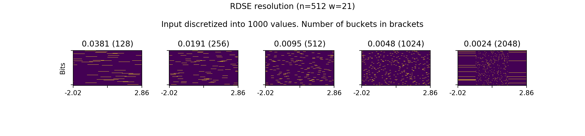
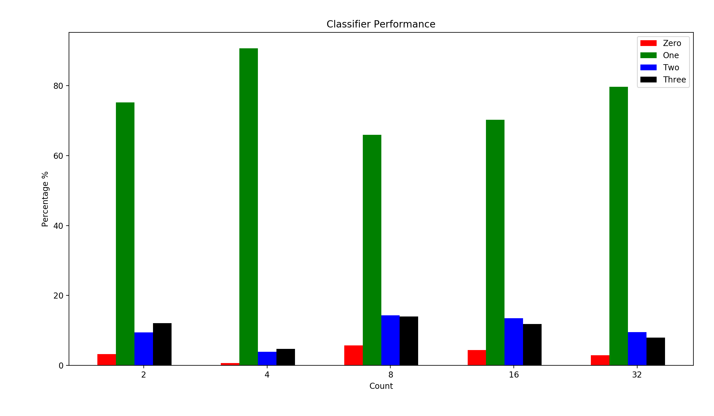

# Mel-frequency cepstral coefficients (MFCCs)

> In sound processing, the mel-frequency cepstrum (MFC) is a representation of the short-term power spectrum of a sound, based on a linear cosine transform of a log power spectrum on a nonlinear mel scale of frequency.

> Mel-frequency cepstral coefficients (MFCCs) are coefficients that collectively make up an MFC[1]. They are derived from a type of cepstral representation of the audio clip (a nonlinear "spectrum-of-a-spectrum"). The difference between the cepstrum and the mel-frequency cepstrum is that in the MFC, the frequency bands are equally spaced on the mel scale, which approximates the human auditory system's response more closely than the linearly-spaced frequency bands used in the normal cepstrum. This frequency warping can allow for better representation of sound, for example, in audio compression.

> MFCCs are commonly derived as follows:[2]
> 1. Take the Fourier transform of (a windowed excerpt of) a signal.
> 2. Map the powers of the spectrum obtained above onto the mel scale, using triangular overlapping windows.
> 3. Take the logs of the powers at each of the mel frequencies.
> 4. Take the discrete cosine transform of the list of mel log powers, as if it were a signal.
> 5. The MFCCs are the amplitudes of the resulting spectrum.

Source: https://en.wikipedia.org/wiki/Mel-frequency_cepstrum

## RDSE encoding

## Results

