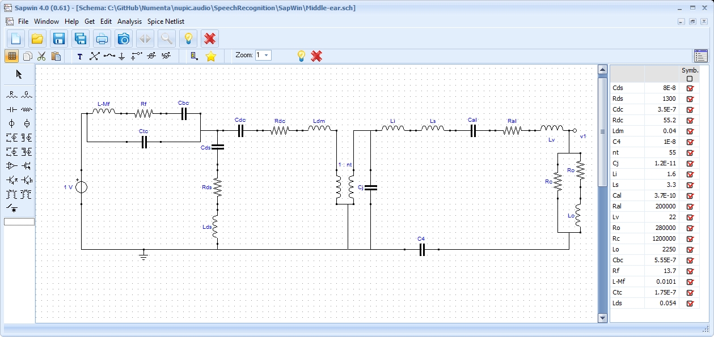
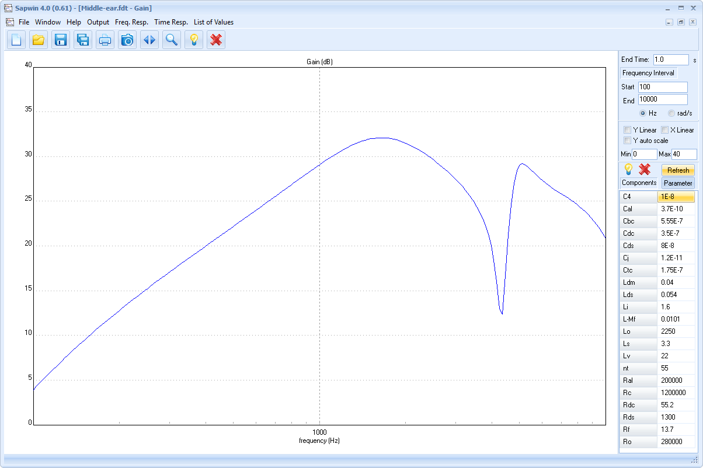

# Recreation of Middle-Ear electrical simulation

The `Middle-ear.sch` file can be loaded into SapWin4 to recreate the diagram shown in "APPENDIX A: MIDDLE-EAR MODEL" of "An auditory-periphery model of the effects of acoustic trauma on auditory nerve responses", Ian C. Bruce, Murray B. Sachs, and Eric D. Young (2003, DOI: 10.1121/1.1519544).

> The ME section of the auditory-periphery model was created by combining the ME cavities model of Peake et al. (1992 with the ME model of Matthews (1983).

In Rasha Ibrahim's PhD Thesis, ["The role of temporal fine structure cues in speech perception" ()](https://macsphere.mcmaster.ca/bitstream/11375/11980/1/fulltext.pdf) (see Appendix: Improvements to the Auditory Periphery Model):

> The 12th-order complete transfer function of the human middle ear is modified to reduce its order to six in order to improve the stability of the filter implementation.

> The auditory periphery model of Zilany and Bruce (2006) has been modified to include the sharp cochlear tuning of humans reported in Shera et al. (2002). The middle ear section of the model has also been modified to allow for using more practical lower sampling frequencies (≈ 100 kHz) rather than the higher sampling rates of 500 kHz that has been used in Zilany and Bruce (2006). The stability of middle ear filter has also been improved by reducing the order of the filter and implementing it digitally as a cascade of 2nd-order filters.

## Requirements

- [SapWin4](http://cirlab.det.unifi.it/SapWin4/) - An integrated package of schematic capture, symbolic analysis and graphic post-processing for linear analog circuits.