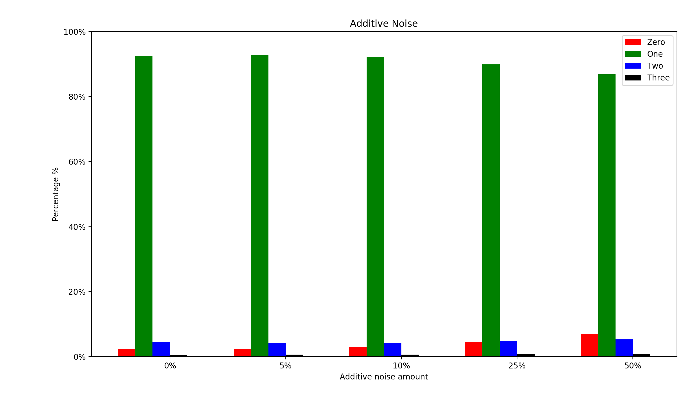
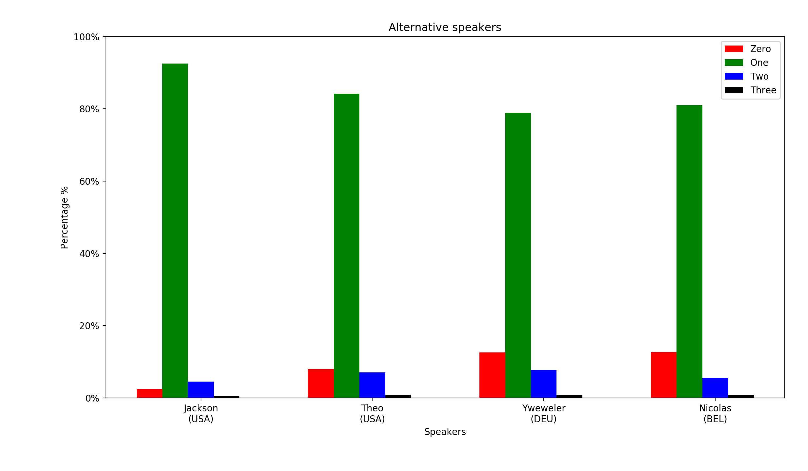

# Speech Recognition

The aim of this example is to:

- Test the ability of NuPIC unsupervised online learning, along with a supervised trained SDR Classifier, to recognize spoken digits.
- To test traditional Fourier Analysis approaches to encoding and simulated biological spike encoding.
- Compare recognition ability with existing ML Neural Networks, particularly and _importantly_, with regards to added background noise and other speakers.

A number of existing ML based examples can be used to compare with this example. For example:

1. [Speech Classification Using Neural Networks: The Basics](https://towardsdatascience.com/speech-classification-using-neural-networks-the-basics-e5b08d6928b7)
1. [Audio Classification using FastAI and On-the-Fly Frequency Transforms](https://towardsdatascience.com/audio-classification-using-fastai-and-on-the-fly-frequency-transforms-4dbe1b540f89)
1. [Using CNNs and RNNs for Music Genre Recognition](https://towardsdatascience.com/using-cnns-and-rnns-for-music-genre-recognition-2435fb2ed6af)

Further information on audio signal processing can be found here: [SPECTRAL AUDIO SIGNAL PROCESSING](https://ccrma.stanford.edu/~jos/sasp/), Stanford's Center for Computer Research in Music and Acoustics (CCRMA)

A brief overview of human ear anatomy can be found here: [Anatomy - Ear Overview](https://www.youtube.com/watch?v=qYv9V2qna6I), Armando Hasudungan.

## Encoding

### [Frequency Encoding](https://github.com/marionleborgne/frequency-encoder)

As described in the Frequency Encoder [README.md](https://github.com/marionleborgne/frequency-encoder/blob/master/README.md) file;  

> The FrequencyEncoder encodes a time series chunk (or any 1D array of numeric values) by taking the power spectrum of the signal and discretizing it. The discretization is done by slicing the frequency axis of the power spectrum into bins. The maximum amplitude of the power spectrum in this frequency bin is encoded by a [Scalar Encoder](http://nupic.docs.numenta.org/1.0.3/api/algorithms/encoders.html#scalar-encoders).

To make use of the Frequency Encoder, continuous signal data needs to be broken into chunks. Achieving this is done by extracting a contiguous chunk of input data and applying an appropriate window function to this chunk of data. The next contiguous chunk of input data is extracted with appropriate overlay with the previous chunk. These chunks of data can then be passed into the Frequency Encoder to obtain a sparse distributed representation (SDR) for each chunk.

https://ccrma.stanford.edu/~jos/sasp/Spectrum_Analysis_Windows.html

Following is an example of using a window function applied to a chunk of input data.


The Frequency Encoder uses a Short Time Fourier Transform (STFT). Care must be taken when determining how big a chunk of input data is (number of data samples),
and the parameters used for the STFT and Frequency Encoder (specifically the Scalar Encoder).

> One of the pitfalls of the STFT is that it has a fixed resolution. The width of the windowing function relates to how the signal is represented - it determines whether there is good frequency resolution (frequency components close together can be separated) or good time resolution (the time at which frequencies change). A wide window gives better frequency resolution but poor time resolution. A narrower window gives good time resolution but poor frequency resolution.  
Source: https://en.wikipedia.org/wiki/Short-time_Fourier_transform

For a great overview of processes involved, and related, to the Frequency Encoder, refer to the following article: [Speech Processing for Machine Learning: Filter banks, Mel-Frequency Cepstral Coefficients (MFCCs) and What's In-Between](https://haythamfayek.com/2016/04/21/speech-processing-for-machine-learning.html)

TODO:
* https://github.com/jameslyons/python_speech_features
* [HIERARCHICAL RESIDUAL-PYRAMIDAL MODEL FOR LARGE CONTEXT BASED MEDIA
PRESENCE DETECTION](https://s3.us-east-2.amazonaws.com/alexapapers/HierarchicalResidualPyramidalModelForLargeContextBasedMediaPresenceDetection.pdf)
* Discuss MFCC features, log mel-filter bank energy (LFBE) features, wrt to SDR encoding and ASR

### [Cochlea Encoding](https://github.com/mrkrd/cochlea)

For spike encoding a Python package called [cochlea](https://github.com/mrkrd/cochlea) can be used.

> cochlea is a collection of inner ear models. All models are easily accessible as  Python functions. They take sound signal as input and return spike trains of the auditory nerve fibers (ANF).

From the three inner ear models implemented in the [cochlea](https://github.com/mrkrd/cochlea) package, one compelling reason to use spike encoding is:

> The ability of auditory models to code speech is already very elaborate, all three outperform classical [Mel-frequency cepstral](https://en.wikipedia.org/wiki/Mel-frequency_cepstrum) features (MFCC), the “gold standard” of automatic speech recognition.

As mentioned in the accompanying research paper [1], the **Zilany model (2014)** [2,3] is the most feature rich.

1. Rudnicki M., Schoppe O., Isik M., Völk F. and Hemmert W. (2015). Modeling auditory coding: from sound to spikes. Cell and Tissue Research, Springer Nature, 361, 159—175. http://link.springer.com/article/10.1007/s00441-015-2202-z
1. Zilany MSA, Bruce IC, Nelson PC, Carney LH (2009) A phenomenological model of the synapse between the inner hair cell and auditory nerve: Long-term adaptation with power-law dynamics. J Acoust Soc Am 126(5):2390
1. Zilany MSA, Bruce IC, Carney LH (2014) Updated parameters and expanded simulation options for a model of the auditory periphery. J Acoust Soc Am 135(1):283–286

Also:
> Offset adaptation is only implemented in Zilany’s phenomenological model. Offset adaptation can be very important for further neuronal processing. Therefore, if modeled auditory nerve fibers (ANF) spike trains are used as input to neurons in the brainstem (or even higher), one should consider the Zilany et al. (2014) model.

Another advantage of using the [cochlea](https://github.com/mrkrd/cochlea) Zilany model implementation, over the Frequency Encoder, is that an entire sample can be input into it, and it returns a convenient [pandas](https://pandas.pydata.org/) data frame. No need to segment/chunk the data and apply a window function.

One disadvantage is that the Zilany model has a lower frequency bound of 125 Hz.

The output of the CochleaEncoder is a neurogram (an image of neural activity). The following figure shows a [SciPy Chirp](https://docs.scipy.org/doc/scipy/reference/generated/scipy.signal.chirp.html), starting at 300 Hz and ramp up to 3000 Hz. With the output neurogram as the central graph, and the bottom graph is a binary representation of the neurogram.


The following shows an input speech signal (the spoken word 'Zero'), with the same central neurogram, and binary representation of the neurogram at the bottom.


The following shows the amount of bit sparsity in the binary neurogram of the speech signal (spoken word 'Zero').


### Resampling speech data

The [Free Spoken Digit Dataset](https://github.com/Jakobovski/free-spoken-digit-dataset) has been recorded using an 8000 Hz sampling rate. With each mono sample typically around one second long. Samples can be up-sampled using a Python package called [resampy](https://github.com/bmcfee/resampy).

> `resampy` is a python module for efficient time-series resampling. It is based on the band-limited sinc interpolation method for sampling rate conversion as described by [1].

1.	Smith, Julius O. Digital Audio Resampling Home Page Center for Computer Research in Music and Acoustics (CCRMA), Stanford University, 2015-02-23. Web published at http://ccrma.stanford.edu/~jos/resample/.

Other resampling methods can be used in Python. Refer to this blog post for an overview: http://signalsprocessed.blogspot.com/2016/08/audio-resampling-in-python.html

### Batch encoding

The Zilany inner ear simulation used in the CochleaEncoder can take quite a while to process an entire sample.

Once the [Free Spoken Digit Dataset](https://github.com/Jakobovski/free-spoken-digit-dataset) (FSDD) repository has been cloned (see below, `RepoClone.py`), the `batch_encode.py` Python script can be used to run the CochleaEncoder on all the FSDD wav files, and produce corresponding NumPy data files.

The CochleaEncoder default entry function is the `encodeIntoNeurogram` that returns the 2-dimensional NumPy neurogram array, that is then saved out.

## Network setup

Spoken digit speech is first encoded (using the Cochlea or Frequency encoder), and sparse distributed representations (SDR) are passed into a Spatial Pooler (SP).

The output of the SP is an array of active column indices that is passed into a Temporal Memory (TM).

The output of the TM is an array of active cells that is passed into the SDR Classifier (CL). Which outputs 1-step ahead classification predictions for each digit shown to the network.

Below are links to further information on the HTM parts used within training and testing.

### Encoder

Further information on Encoders can be found in the Numenta BaMI:
- https://numenta.com/assets/pdf/biological-and-machine-intelligence/BaMI-Encoders.pdf

### Spatial Pooler

Further information on Spatial Pooling can be found in the following Numenta website pages:
- https://numenta.com/neuroscience-research/research-publications/papers/htm-spatial-pooler-neocortical-algorithm-for-online-sparse-distributed-coding/
- https://numenta.com/resources/biological-and-machine-intelligence/spatial-pooling-algorithm/

### Temporal Memory

Further information on Temporal Memory can be found in the following Numenta website page:
- https://numenta.com/resources/biological-and-machine-intelligence/temporal-memory-algorithm/

### SDR Classifier

[Andrew Dillon](https://andrewjdillon.com/) has produce an excellent breakdown of the SDR Classifier. Refer to his webpage for further information: http://hopding.com/sdr-classifier

> The purpose of the SDR Classifier is identical to that of the older CLA Classifier: learn associations between a given state of the Temporal Memory at time t, and the value that is to be fed into the Encoder at time t+n (where n is the number of steps into the future you want to predict. t+1, t+5, t+2 - or all three!). You can also think of it as mapping activation patterns (vector of Temporal Memory’s active cells) to probability distributions (for the possible encoder buckets).

## Training

### Classifier training

One question arises from the supervised training required by the SDR Classifier. How many times do the speech samples need to be presented to the classifier, via the spatial pooler and temporal memory.

The following graph shows the progress of the classifier when presenting the four speech samples (random order) twice, four, eight, sixteen, and thirty two times. The classifier is tested with the spoken "One" speech sample. The classifier achieves a 92% prediction accuracy when it trained with the four speech samples thirty two times. And as expected, the prediction of the other speech samples diminishes.


## Testing

### Heard and Unheard spoken digits

Training using four speech samples (spoken words "Zero", "One", "Two", and "Three"). 16 times randomly, i.e. 64 speech samples total.

Testing with one **heard** spoken word "One", achieves 74% prediction accuracy:


Testing with one **unheard** spoken word "One", achieves 59% accuracy:


### Speaker variation

Training with six variations of the digits "Zero", "One", "Two", and "Three". Randomly presented for a total of 64 spoken digits.

Testing with four **unheard** variations of the spoken digit "One".


### Additive background noise

The `mix_noise.py` Python script takes an Urban Traffic wav file and mixes it with a speech sample. Outputting new speech wav files with 5%, 10%, 25%, and 50% of the noisy traffic mixed in.

The Urban Traffic wav file can be downloaded here: http://soundbible.com/641-Urban-Traffic.html

Similar to the speaker variation the network is trained using 6 variations of the spoken words "Zero", "One", "Two", and "Three". The **unheard** spoken word "One", with added traffic noise, is then tested against the network.

Below are the results from the SDR Classifier:


### Alternative speakers

Similar to the speaker variation test. One speakers ("Jackson") speech is used during network and classifier training. Then the network is tested with three other speakers, all saying the spoken word "One".

Below are the results from the SDR Classifier for all four speakers:


## Dimensionality reduction/attention

The majority of the tests conducted so far, have used a small subset of speech data for training and testing (10 - 25 milliseconds worth). The main reason for this is that the Zilany inner ear model, used in the CochleaEncoder, requires the speech data to use a 100 kHz sampling frequency. That creates around 50K SDRs for each speech sample, and has big implications on the time it takes to train and test a HTM network on a typical laptop/PC.

We know that using 2.5K SDRs (25 milliseconds) per speech data provides a manageable amount of training and testing. But can we reduce the number of SDRs that get sent into a HTM network _and_ still maintain the encouraging results seen so far?

Overviewing the passage of auditory sensory information from the inner ear through to the cortex, there are quite a few processing stages containing a variety of cell types. A tonotopic layout is maintained from hair cell layout to cortex. So we can investigate the contribution of various cell types with respect to dimensionality reduction and/or attentional mechanisms.

TODO: LIF/Izhikevich cells, STDP rules, CF/Group integration,  Temporal disruption, ...

### Ventral Cochlea Nucleus (VCN)

Pathways from the Ventral Cochlea Nucleus towards the thalamas and cortex:
- Superior Olivary cluster (SO, incl. horizontal sound localization)
- Ventral Nuclei of the Lateral Lemnicus (VNLL, incls. pattern recognition)
- Inferior Colliculus (IC, incls. vertical sound localization assisted by the Dorsal Cochlea Nucleus)

The VCN feeds into the SO and VNLL, then they both feed into the IC.

TODO: LNTB and VNTB projection to IC. Deiter and Henson cells?

### Ventral Nuclei of the Lateral Lemniscus (VNLL)

> Two patterns of responses to tones have been observed in recordings from the ventral lemniscal nuclei. Regular, sustained firing and are sharply tuned; others respond with a sharply timed action potential at the onset of a tone and are broadly tuned. While many authors consider the ventral lemniscal nuclei to be monaural, many studies shown that neurons in this area are indeed consistently driven through the contralateral ear.  
Spherical bushy cells (SBCs) in the VNLLv are broadly tuned and respond at the onset of sounds. The responses to sound of neurons in the columnar region of the bat and and the VNLLv of the cat resemble responses to sound of octopus cells in many ways. Like neurons in the columnar area of the VNLL of bats, octopus cells responded to the directionality of sweeps.  
Other neurons in the VNLL and INLL respond to tones with regular, sustained firing or "chopping". These neurons were sharply tuned. Their nonmonotonic firing rates as a function of intensity that inhibition contributed to responses to sounds.  
Bushy and stellate cells that provide the major excitatory input to the more sharply tuned and tonically firing multipolar cells of the ventral lemniscal nuclei are sharply tuned and respond to tones with more sustained firing.  
Source: Chapter 6.4, Integrative Functions in the Mammalian Auditory Pathway, Editors Oertel, Fay, and Popper. Springer ISBN 0-387-98903-X

### Inferior Colliculus (IC)

## Dataset, Git clones, and Python packages

Dependent python packages can be install using the following command:

```sh
pip install -r requirements.txt
```

### Repository cloning (`RepoClone.py`)

Dependent Git repositories can be cloned using the following Python script:

```sh
python RepoClone.py
```

**Note**: `RepoClone.py` uses [GitPython](https://github.com/gitpython-developers/GitPython). That requires [Git](https://git-scm.com/) being installed on the system, and accessible via the system's PATH.

The following repositories are cloned using this Python script:

#### Free spoken digit dataset (FFDD)

A free audio dataset of spoken digits. Think MNIST for audio - https://github.com/Jakobovski/free-spoken-digit-dataset

#### Frequency Encoder

A custom frequency encoder for the HTM - https://github.com/marionleborgne/frequency-encoder

#### ISOLET dataset

This dataset is optional and is **not** cloned as part of the `RepoClone.py` Python script. The database consists of 7800 spoken letters, 2 productions of each letter by 150 speakers - https://archive.ics.uci.edu/ml/datasets/isolet

## Future Work

### Cochlear Nucleus

> The mammalian cochlear nucleus (CN) consists of a diverse set of neurons both physiologically and morphologically that are involved in processing different aspects of the sound signal.  

Source: [Response patterns to sound associated with labeled globular/bushy cells in cat](https://www.ncbi.nlm.nih.gov/pmc/articles/PMC2518325/)

TODO: https://github.com/mrkrd/cochlear_nucleus - A young repo that looks too limited in it's potential usage in this example.

> Bushy cells preserve or sharpen information in the firing patterns of auditory nerve fibers that conveys the fine structure of sounds, including phase locking at low frequencies. Octopus cells detect the coincident firing of large groups of auditory nerve fibers, signaling the presence of onsets and broadband transients. Individual T-Stellate cells detect the amplitude of sounds over a narrow frequency range and as a population they detect the ongoing spectrum of sounds impinging on the ear. D-Stellate cells detect coincident firing from many auditory nerve fibers but the temporal and spatial summation of inputs obscures temporal fine structure.  

Source: [The Cochlear Nuclei: Synaptic Plasticity in Circuits and Synapses in the Ventral Cochlear Nuclei](https://www.oxfordhandbooks.com/view/10.1093/oxfordhb/9780190849061.001.0001/oxfordhb-9780190849061-e-4)

[Signal integration at spherical bushy cells enhances representation of temporal structure but limits its range.](https://elifesciences.org/articles/29639)
eLife 2017;6:e29639 DOI: 10.7554/eLife.29639
