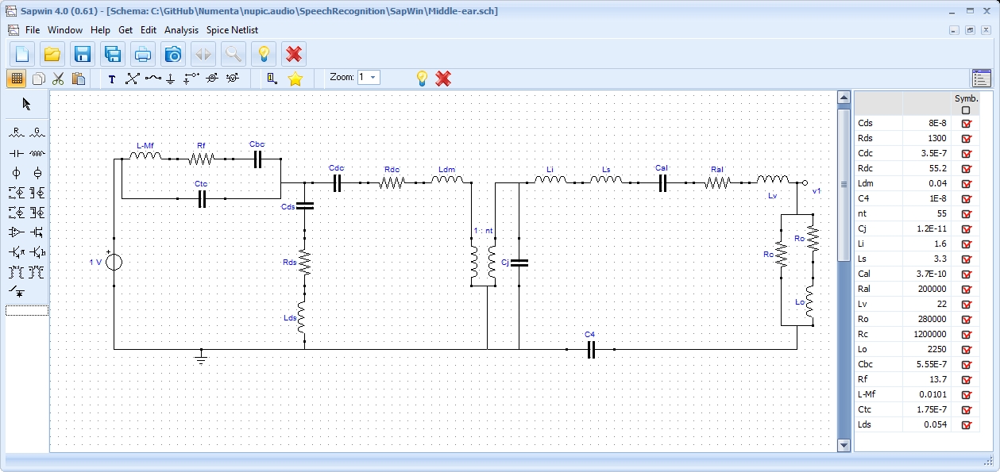
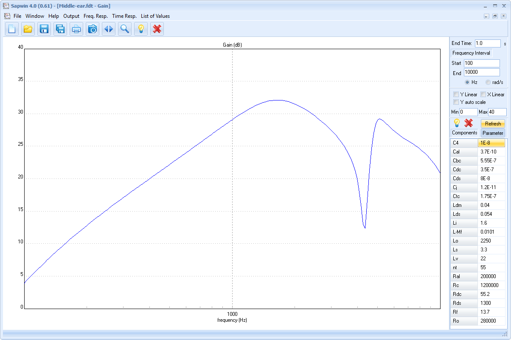

# Recreation of Middle-Ear electrical simulation

The `Middle-ear.sch` file can be loaded into SapWin4 to recreate the ... diagram.

## Requirements

- [SapWin4](http://cirlab.det.unifi.it/SapWin4/) - An integrated package of schematic capture, symbolic analysis and graphic post-processing for linear analog circuits.